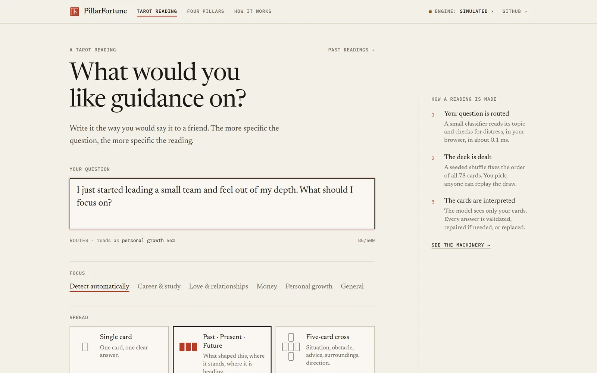
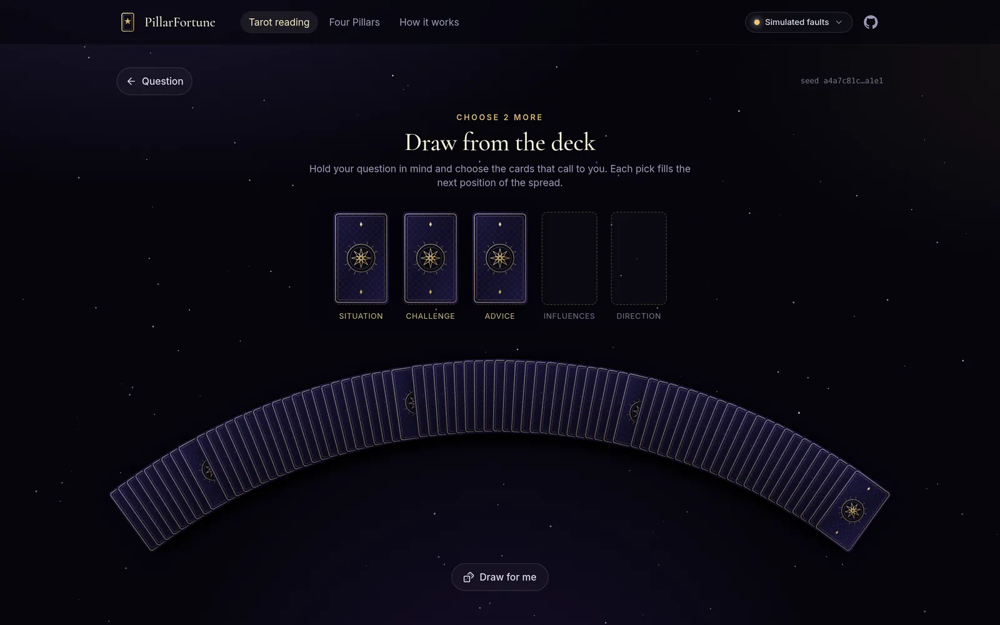
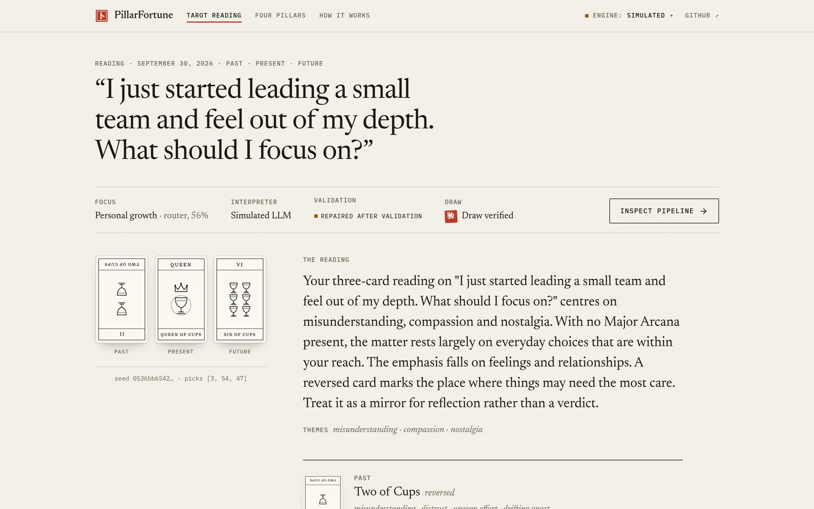
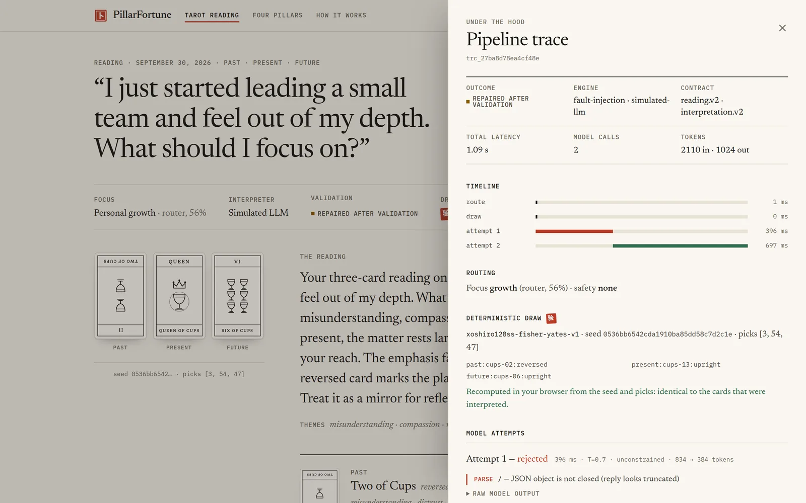
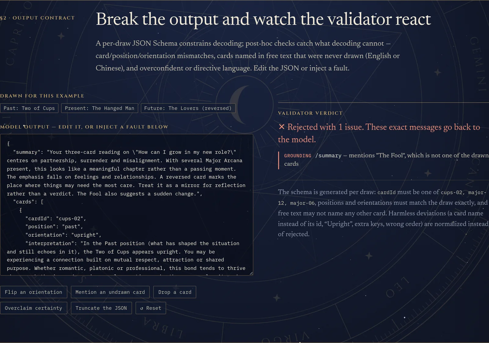
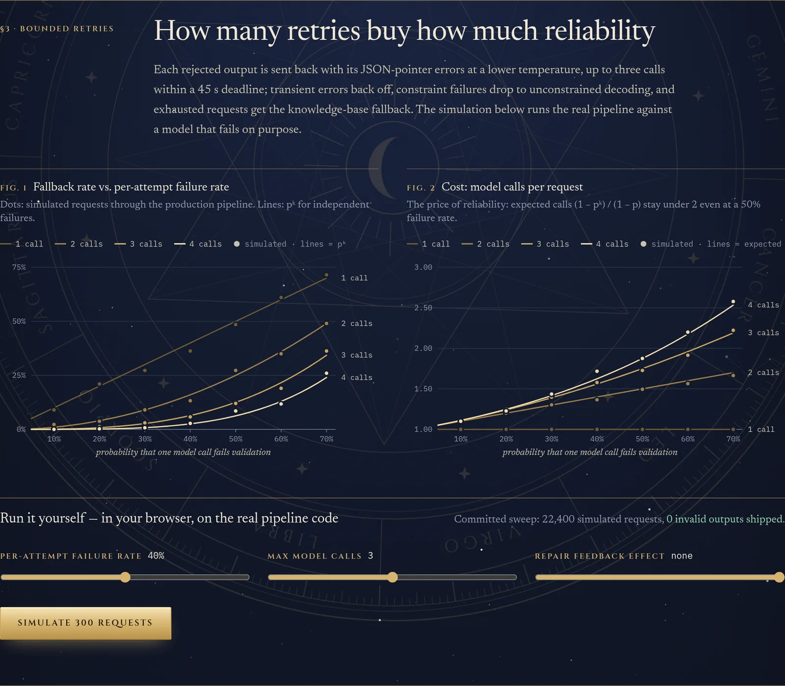
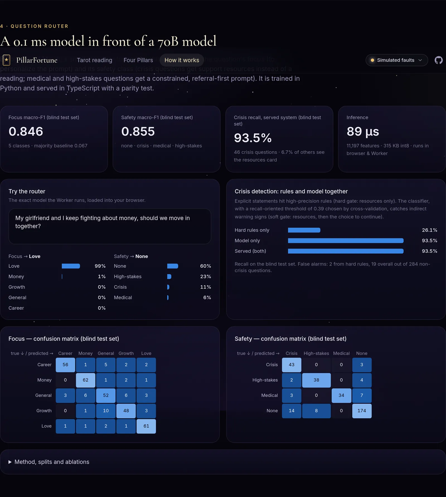
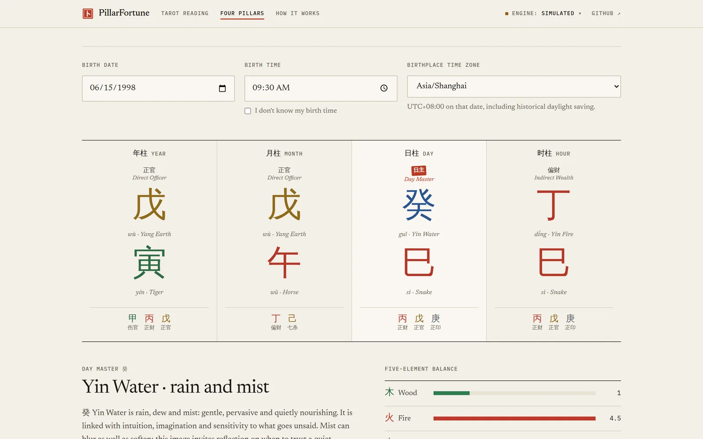
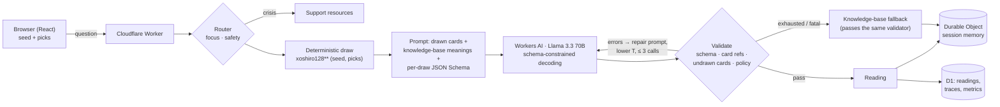

# PillarFortune

**Grounded conversational tarot — an LLM application built like an ML system.**

Cards are drawn by a seeded, verifiable shuffle; a language model only *interprets* them, inside a per-draw JSON Schema contract that is validated on every call (card references, invented cards, tone), with bounded repair retries and a deterministic fallback. A small trained router personalizes each request and routes crisis questions to support resources. Every reading carries an inspectable trace, and an offline harness evaluates the pipeline.

[](https://github.com/Lukewangw/PillarFortune/actions/workflows/ci.yml)
[](https://github.com/Lukewangw/PillarFortune/actions/workflows/deploy-pages.yml)

**Live demo:** https://lukewangw.github.io/PillarFortune/ · **How it works (interactive):** https://lukewangw.github.io/PillarFortune/#/lab

| Ask | Draw from the seeded deck | Reading | Pipeline trace |
|---|---|---|---|
|  |  |  |  |
| **Break the output** | **Retries vs. reliability** | **Question router** | **Four Pillars** |
|  |  |  |  |

> The GitHub Pages build runs the same pipeline code in the browser, with an offline knowledge-base engine and a *simulated* LLM that fails on purpose (so you can watch validation, repair and fallback). The Cloudflare deployment serves the identical frontend with the live model — Llama 3.3 70B on Workers AI — behind Durable Object sessions and D1.

## Highlights

- **Zero invalid outputs shipped** in 22,400 simulated requests with per-call failure rates from 10% to 70% (fault injection through the production code path); empirical fallback rates track the closed form pᵏ (e.g. p = 0.3, k = 3: 3.0% measured vs 2.7% predicted). [`ml/evals/simulate.ts`](ml/evals/simulate.ts)
- **The LLM never picks a card.** xoshiro128\*\* + Fisher–Yates from a 128-bit seed; the Worker recomputes the draw from (seed, picks) and the browser re-verifies it. A χ² uniformity test over 78,000 shuffles runs in CI (and in the browser on the Lab page).
- **Trained question router**, served in the browser and at the edge in ~0.1 ms: on a **blind test set** (330 questions, English and Chinese, written independently and scored once) — focus macro-F1 **0.846**, safety macro-F1 **0.855**, crisis recall **93.5%** with support shown to 6.7% of ordinary questions (0.7% blocked by the hard gate). Python training, TypeScript inference, parity to 6 decimals.
- **Four Pillars (BaZi) from astronomy**: solar terms from Meeus' solar theory are within 0.53 min of `ephem` (1950–2050), and the pillars agree with `lunar-python` on 100% of 4,000 random birth times.
- **Tested end to end**: 154 unit tests; an 18-check API smoke test against the real Workers runtime (Durable Objects + D1, including concurrent follow-ups to one session); 8 Playwright E2E runs (desktop + mobile) in CI.

## Architecture



One request path serves every runtime: [`src/core/orchestrate.ts`](src/core/orchestrate.ts) is called by the Worker, by the browser's offline and simulated engines, and by the eval harness — so what is evaluated is what is served.

## The reliability pipeline

| Piece | What it does | Code |
|---|---|---|
| Output contract | A JSON Schema generated **per draw**: `cardId` and `position` are enums of what was actually drawn, `cards` has exactly one entry per card. A structural copy constrains decoding; length limits are checked afterwards (limits inside a decoding grammar truncate text mid-sentence). | [`schemas.ts`](src/core/llm/schemas.ts), [`jsonschema.ts`](src/core/llm/jsonschema.ts) |
| Extraction & normalization | Pulls the JSON out of fenced or chatty replies; fixes harmless deviations deterministically (card name instead of id, "Upright", extra keys, wrong order) and records each fix in the trace instead of paying for a retry. | [`extract.ts`](src/core/llm/extract.ts), [`validate.ts`](src/core/llm/validate.ts) |
| Grounding checks | Every drawn card referenced exactly once with the right position and orientation; **no other card may be named anywhere in the free text** (English and Chinese names, with precision rules so "the sun on your face" is not a card). | [`validate.ts`](src/core/llm/validate.ts), [`mentions.ts`](src/core/tarot/mentions.ts) |
| Policy checks | No certainty claims ("you will definitely…"), no medical or financial directives. | [`policy.ts`](src/core/llm/policy.ts) |
| Bounded retries | Rejected outputs go back with the exact JSON-pointer errors at a lower temperature (0.7 → 0.4 → 0.2), at most 3 calls within a 45 s deadline. Transient errors back off; "JSON mode couldn't be met" degrades to unconstrained decoding; fatal errors (quota, auth) go straight to the fallback. | [`generate.ts`](src/core/llm/generate.ts) |
| Fallback | A deterministic reading composed from an original 78-card knowledge base; property-tested to pass the same validator on 2,000 random draws. | [`fallback.ts`](src/core/llm/fallback.ts) |
| Traces | Every span and attempt (raw output, issues, tokens, latency) is returned to the client ("Inspect pipeline") and stored in D1; `/api/metrics` aggregates validity at the first call, fallback rate and reasons, p50/p95 latency and the most common failure codes. | [`trace.ts`](src/core/llm/trace.ts), [`worker/src/metrics.ts`](worker/src/metrics.ts) |

The **fault-injection provider** ([`faultInjection.ts`](src/core/llm/providers/faultInjection.ts)) writes a correct answer and corrupts it the way real models fail — truncated JSON, missing fields, swapped card references, invented cards, overconfident claims, 503s — at configurable rates. It powers the unit tests, the reliability sweep, the in-browser simulator and the "Simulated faults" engine.

## Sessions: Durable Objects

One `TarotSession` Durable Object per reading ([`worker/src/session.ts`](worker/src/session.ts)) holds the question, the drawn cards, the reading summary, the last 8 messages and an LLM-compressed memory of older turns (validated for length and grounding, with an extractive fallback). Follow-ups are processed strictly one at a time through an in-object queue — model calls are I/O, during which a Durable Object would otherwise interleave requests — and the API smoke test fires concurrent messages at one session to prove no turn is lost. Sessions expire after 7 days (storage alarm); a session allows 30 follow-ups.

## Question router

A small model in front of the 70B one: **focus** (career, love, finance, growth, general) personalizes the prompt; **safety** (none, crisis, medical, high-stakes) routes the request.

- **Model**: sublinear TF-IDF over words, word bigrams, CJK characters/bigrams and character 3–5-grams (11,197 features) → two logistic-regression heads, int8-quantized per class (315 KB JSON, 130 KB gzipped, lazy-loaded). [`ml/router/train.py`](ml/router/train.py) trains it; [`router.ts`](src/core/router/router.ts) serves it; a parity test replays Python's probabilities in TypeScript to 6 decimals.
- **Selection**: vocabulary size by nested 5-fold CV (smallest size within 0.005 macro-F1 of the best), C by CV, balanced class weights for safety.
- **Operating point**: the crisis threshold maximizes out-of-fold recall subject to ≤ 5% of ordinary questions seeing the support card. **Two-tier gate**: explicit statements hit high-precision rules (hard gate: resources only, no reading); model detections and softer warning signs show resources and let the person continue, and the prompt then asks the model to be especially gentle and point to support. [`crisis.ts`](src/core/router/crisis.ts)
- **Data**: 1,449 training questions (1,024 + 425 targeted examples added after error analysis on dev), a dev set of 323, and a blind test set of 330 written by a separate author without access to the other splits; ~20% Chinese. All splits are **synthetic** (LLM-authored and checked), so real traffic will look different.

| Blind test (n = 330) | macro-F1 | notes |
|---|---|---|
| Focus | **0.846** | majority baseline 0.067; English 0.852, Chinese 0.809; weakest class: *general* (0.743) |
| Safety | **0.855** | crisis recall 93.5% (43/46); medical precision 1.00, recall 0.77 |
| Crisis false alarms | 6.7% soft · 0.7% hard | 19 of 284 non-crisis questions see the support card; 2 are blocked |

Known failure modes from the blind test (left unfixed so the numbers stay honest; a fix needs a fresh test set): indirect harm-to-others phrasing ("同归于尽", veiled revenge plans), "只有死了才能解脱" (not in the rules, missed by the model), and two hard-gate false alarms on hyperbole ("想跳楼哈哈哈") and a car term ("suicide doors"). Full reports: [`system-metrics.json`](ml/router/reports/system-metrics.json), [`metrics.json`](ml/router/reports/metrics.json).

## Evaluation harness

[`ml/evals/run.ts`](ml/evals/run.ts) replays [55 readings and 21 follow-ups](ml/evals/datasets/readings.jsonl) — ordinary questions, prompt injections, format attacks, requests for undrawn cards, demands for certainty, medical and high-stakes questions, edge cases, Chinese — through the production code path under four ablations:

| Variant | Description |
|---|---|
| `v1-baseline` | The project's original single-call prompt and `JSON.parse`, audited with the v2 validators (how often shipped text names undrawn cards or overclaims) |
| `v2-single` | Grounded prompt + validator, 1 call, fallback on failure |
| `v2-repair` | + validation-feedback repair, ≤ 3 calls |
| `v2-constrained` | + JSON-Schema constrained decoding — production |

It reports validity at the first call, share served from the model, fallback rate, mean calls, p50/p95 latency and tokens, per variant and per subset. Running it against the real model needs a Cloudflare API token:

```bash
CLOUDFLARE_ACCOUNT_ID=… CLOUDFLARE_API_TOKEN=… npm run eval -- --provider workers-ai --publish   # writes ml/evals/results/eval-latest.json
OPENAI_BASE_URL=… OPENAI_API_KEY=… npm run eval -- --provider openai --model <id>              # any OpenAI-compatible endpoint
npm run eval -- --provider fault-injection                                                    # no network: exercises the harness
```

or through the manual **LLM evaluation** workflow in GitHub Actions (secrets `CLOUDFLARE_ACCOUNT_ID`, `CLOUDFLARE_API_TOKEN`). Published results appear on the Lab page. *Real-model numbers are not in this repository yet — they have to be produced with the account's token.*

## Four Pillars (BaZi)

The previous version derived pillars from naive modular arithmetic on the Gregorian date and filled the page with random text. The rewrite ([`src/core/bazi`](src/core/bazi)) computes the Sun's apparent longitude (Meeus' higher-accuracy theory with nutation, aberration and ΔT), finds the twelve 节 solar-term instants, turns the year at 立春, derives month and hour stems with the 五虎遁/五鼠遁 rules, counts days from the Julian Day Number, and adds hidden stems, ten gods and a weighted five-element balance. The page resolves historical time zones and daylight saving (e.g. China 1986–91) through the browser's tz database.

## Repository

```text
src/core/            pure TypeScript shared by browser, Worker and evals
  tarot/             78-card knowledge base, spreads, seeded draw engine, card-mention detector
  llm/               schemas, validators, prompts, generate/repair loop, fallback, traces, providers
  router/            router inference, crisis rules, exported model + parity fixture
  bazi/              Four Pillars astronomy and calendar
  orchestrate.ts     the single request path
src/features/        React UI: reading flow, Four Pillars, "How it works" lab
worker/src/          Cloudflare Worker: API, TarotSession Durable Object, D1 schema, metrics, cost guards
ml/router/           datasets, training (Python), serving-side evaluation (TypeScript), reports
ml/evals/            LLM eval harness, datasets, reliability simulation, results
scripts/smoke-api.ts API smoke test against a running Worker
e2e/                 Playwright tests
```

## Run it

```bash
npm ci
npm run dev                                   # frontend on :5173 (offline + simulated engines)
npm run build && npx wrangler dev -c wrangler.test.jsonc   # full stack on :8787: Worker + DO + local D1, simulated model, no login
npx wrangler dev                              # full stack with the real Workers AI model (needs `wrangler login`)

npm run check                                 # typecheck + unit tests + build
npm run smoke                                 # API smoke test against :8787
npm run e2e                                   # Playwright (E2E_BASE_URL=http://127.0.0.1:8787 for the full stack)

pip install -r ml/router/requirements.txt
npm run router:train                          # retrain the router and re-evaluate (dev)
npx tsx ml/router/evaluate.ts --blind-test    # score the blind test set
npm run eval:simulate                         # reliability sweep → ml/evals/results/simulation.json
```

## Deploy

- **Cloudflare (full stack, live model).** The repository is connected to Cloudflare Workers Builds: merging to `main` runs `npm run build` and deploys the Worker with the frontend as static assets (`assets.directory: dist`). Manually: `npm run deploy`. The D1 schema bootstraps itself on first request (also in `worker/migrations/0002_v2.sql`). Cost guards are plain vars in `wrangler.jsonc`: `DAILY_LLM_BUDGET` model calls per UTC day (default 300 — beyond it readings are served by the knowledge-base composer), `PER_IP_DAILY_READINGS`, `PER_IP_DAILY_FOLLOWUPS`; `LLM_MODEL` switches the model (e.g. `@cf/meta/llama-3.1-8b-instruct-fast` for lower cost).
- **GitHub Pages (static).** `.github/workflows/deploy-pages.yml` builds with `--mode pages` and publishes `dist/` to the `gh-pages` branch on every push to `main`. Set the repository variable `PILLARFORTUNE_API_URL` to the Worker's URL to connect the Pages build to the live model; without it the site uses its in-browser engines.

## Design notes

- **Deterministic facts, generated interpretation.** Anything that must be exact (which cards, where, which way up; the calendar) is computed and tested; the model only writes prose about given facts, so every output can be checked against ground truth.
- **Constrain structure at decode time, validate content afterwards.** Enums and required keys go into the decoding schema; lengths, pairings, cross-field consistency, invented cards and tone are checked post hoc with precise error paths that double as the repair prompt.
- **Pay for retries only when they help.** Normalization absorbs harmless deviations; temperature drops on each repair; the deadline and a daily call budget bound latency and cost; every path ends in an output that passes the same validator.
- **Small model first.** A 0.1 ms classifier decides whether to call the 70B model at all and how, and it runs identically in the browser for instant feedback while typing.
- **Honest evaluation.** Blind test scored once, dev used for error analysis, simulation labeled as simulation, real-model results only from real runs.
- **Look like what it is.** The interface is set like a printed almanac — paper, ink and one vermilion accent, a serif for reading and a monospace for machinery — so the checkable parts (seeds, traces, validator findings) read as first-class content rather than decoration. Rules and references: [docs/DESIGN.md](docs/DESIGN.md).

## Responsible use

Readings are for reflection and entertainment, not advice. Medical and high-stakes questions get a constrained, referral-first prompt; crisis language gets support resources (988 in the US, Samaritans 116 123 in the UK and Ireland, 12356 in mainland China, findahelpline.com elsewhere) instead of a reading. Questions routed to the support card are not stored (only an anonymous routing trace); sessions expire after 7 days; history is keyed to an anonymous id kept in the browser.

## Credits

The card art is an original SVG deck drawn for this project in the manner of a printed Marseille deck, and the card meanings are original text. Typefaces: Newsreader (Production Type) and IBM Plex Mono, both under the SIL Open Font License. Development used AI assistance; see [PROMPTS.md](PROMPTS.md).
